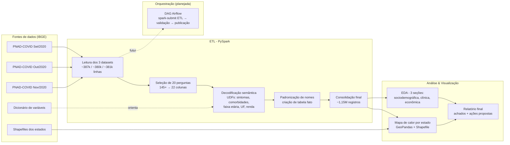

# 📊 PNAD-COVID-19: ETL e Análise com PySpark para Preparação Hospitalar


-017CEE?logo=apacheairflow&logoColor=white)


## 👥 Autoria

Michael Jourdain Gbedjinou — Pós-Tech Data Analytics (FIAP).

## 🎯 Problema de negócio

Entender como foi o comportamento da população brasileira durante a pandemia de COVID-19 e **quais indicadores seriam relevantes para o planejamento hospitalar**, caso ocorra um novo surto da doença.

O projeto simula o papel de um time de dados que recebe um problema real de gestão hospitalar e precisa transformar microdados brutos da pesquisa domiciliar **PNAD-COVID-19 (IBGE)** em indicadores acionáveis, cobrindo três dimensões: sintomas clínicos, comportamento da população e características socioeconômicas.

**Pré-requisitos definidos para o projeto:**
- Uso de no máximo 20 perguntas da pesquisa original
- Janela de 3 meses de dados (set/out/nov de 2020)
- Cobertura de: sintomas clínicos, comportamento populacional e características econômicas


## 🏗️ Arquitetura / Fluxo de dados



## ⚙️ Fases de execução

### 1. Ingestão — Extração da base de dados
Leitura dos três arquivos brutos da PNAD-COVID-19 (setembro, outubro e novembro de 2020) via **PySpark (`SparkSession`)**, totalizando **387.298 + 380.461 + 381.438 registros**, cada um com 145+ colunas — a maioria com altíssima proporção de valores nulos. Essa extração deu visão geral do conteúdo disponível antes da modelagem.

### 2. Transformação — Manipulação dos dados
- **Criação de uma tabela fato**, renomeando colunas conforme o dicionário oficial da PNAD.
- **Seleção de 20 perguntas** (das 145+ disponíveis), com critério explícito de relevância analítica + baixa proporção de nulos, para reduzir viés na tomada de decisão.
- **Decodificação semântica via UDFs**: UF, faixa etária, sexo, sintomas (febre, tosse, falta de ar, perda de olfato/paladar), comorbidades (hipertensão, doença respiratória, cardíaca, câncer), plano de saúde, teste de COVID, e variáveis socioeconômicas (restrição de contato, auxílio emergencial, seguro-desemprego, solicitação de empréstimo).
- **Consolidação dos 3 meses** em uma base única de **~1.149.197 registros**.

### 3. Orquestração
Hoje o pipeline roda manualmente, célula-a-célula, em notebook. Como próximo passo do projeto, a lógica de ETL está sendo extraída para módulos `.py` em `src/`, orquestrados por uma **DAG do Airflow** (`dags/pnad_covid_pipeline.py` — ver stub incluído neste repositório) que simula o fluxo `spark-submit ETL → validação de schema → publicação da base tratada`.

### 4. Visualização
Gráficos organizados em **3 seções analíticas** (sociodemográfica, sintomas clínicos, econômica) usando pandas/matplotlib/seaborn, além de um **mapa de calor por estado** (GeoPandas + shapefiles do IBGE) para visualizar a distribuição geográfica dos indicadores. Os achados foram consolidados em relatório final com recomendações para gestão hospitalar.

## 🛠️ Stack técnica e por quê

| Camada | Tecnologia | Por quê |
|---|---|---|
| Processamento distribuído | **PySpark** (`pyspark.sql`, DataFrame API, UDFs) | Volume de +1M linhas e necessidade de transformação em escala — mesma lógica usada em pipelines de produção |
| Manipulação/EDA | **pandas, numpy** | Análises exploratórias após a consolidação via Spark |
| Visualização | **matplotlib, seaborn** | Gráficos das 3 seções analíticas (sociodemográfica, clínica, econômica) |
| Geoespacial | **GeoPandas + Shapefiles (IBGE)** | Mapa de calor por estado |
| Ambiente | **Jupyter Notebook** | Exploração iterativa documentada lado a lado com o código |
| Orquestração (planejada) | **Apache Airflow** | Simular a transição de notebook exploratório para pipeline agendável/produtizável |

## 💻 Como rodar localmente

```bash
git clone https://github.com/MichaelJourdain93/PNAD_COVID_TECH_CHALLENGE.git
cd PNAD_COVID_TECH_CHALLENGE

python -m venv .venv
source .venv/bin/activate   # Windows: .venv\Scripts\activate

pip install -r requirements.txt

jupyter notebook notebooks/01_etl_pnad_covid.ipynb
```

> Os microdados brutos da PNAD-COVID-19 não são versionados no Git. Baixe-os direto do [FTP do IBGE](https://ftp.ibge.gov.br/Trabalho_e_Rendimento/Pesquisa_Nacional_por_Amostra_de_Domicilios_continua/Trabalho_e_garantia_de_renda_durante_a_pandemia_de_Covid-19/Microdados/) e coloque em `data/raw/`.

## 📈 Resultados / Insights

- **Perfil socioeconômico como fator de risco:** mais de **60% dos internados por COVID-19** pertenciam às faixas de renda mais baixas — indicando que vulnerabilidade econômica é um preditor relevante de gravidade clínica.
- **Sintomas como sinal precoce:** febre, tosse e dificuldade respiratória foram os sintomas mais prevalentes, reportados por **~10% dos entrevistados**, reforçando seu valor como indicadores-chave de triagem.
- **Choque no mercado de trabalho:** o desemprego chegou a **~14%** nos meses mais críticos da pandemia, concentrado em trabalhadores informais e nos setores de comércio e serviços.
- **Ciclo de desigualdade:** a análise indicou um efeito circular — vulnerabilidade econômica reduz o acesso a cuidados de saúde, o que agrava os sintomas clínicos nas populações mais pobres; grupos negros e pardos enfrentaram maiores dificuldades de acesso a serviços de saúde adequados.
- **Ações recomendadas ao hospital**, derivadas diretamente dos dados:
  1. **Triagem clínica automatizada** para febre, tosse e dificuldade respiratória, otimizando alocação de recursos.
  2. **Foco em populações vulneráveis** (idosos, comorbidades, baixa renda) via atendimento domiciliar e telemedicina, reduzindo hospitalizações evitáveis.
  3. **Parcerias para mitigação econômica e social** (governo/ONGs) — cestas básicas, auxílio a medicamentos e ações educativas em comunidades carentes.

## 🔭 Próximos passos

- [ ] Extrair a lógica do notebook para módulos `.py` testáveis em `src/`
- [ ] Adicionar a DAG do Airflow (`dags/pnad_covid_pipeline.py`) ao fluxo real, com `SparkSubmitOperator`
- [ ] Publicar o mapa de calor como visual interativo (Folium/Streamlit) em vez de imagem estática


## 📁 Estrutura do projeto

```
PNAD_COVID_TECH_CHALLENGE/
├── README.md
├── requirements.txt
├── .gitignore
├── notebooks/
│   └── PNAD_covid_19.ipynb
├── dags/
│   └── pnad_covid_pipeline.py         # stub de orquestração Airflow
├── data/
│   └── raw/
│       └── SOURCES.md                 # link oficial do IBGE para baixar os 3 datasets brutos
├── reports/
│   └── mapa_calor_estados/
│       └── SOURCES.md                 # link do shapefile usado no mapa de calor
└── docs/
    ├── Fase3_Tech_Challenge_Grupo62.pdf
    ├── tech_challenge_briefing.txt    # enunciado original do desafio
    ├── datasets_import_google_colab.png
    └── dicionario_pnad_covid/
        ├── Dicionario_PNAD_COVID_092020_20220621.xls
        ├── Dicionario_PNAD_COVID_102020_20220621.xls
        ├── Dicionario_PNAD_COVID_112020_20220621.xls
        └── de_para_variaveis_selecionadas.txt
```
